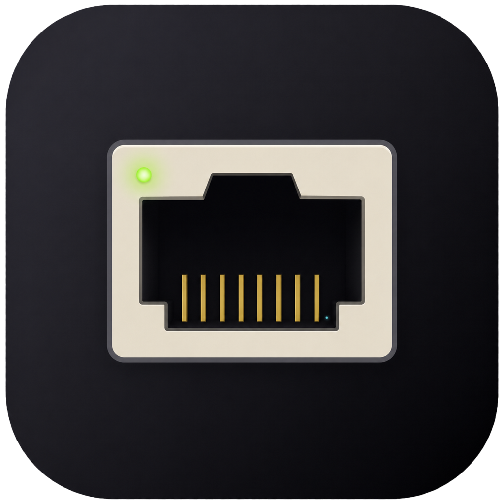
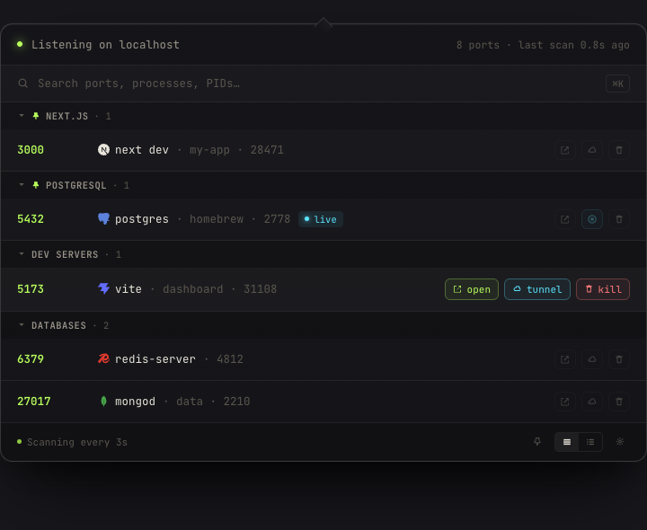

<div align="center">



# Manfath

**See every port. Kill what you don't need. Share the rest.**

A native macOS menu bar app that shows localhost listening ports and lets
you open, copy, kill, inspect, share over Cloudflare Tunnel or ngrok, and
scan to your phone. Built with SwiftUI + AppKit, targets macOS 14+.



[](https://github.com/Dnymte/manfath/actions/workflows/ci.yml)
[](https://github.com/Dnymte/manfath/releases/latest)
[](https://github.com/Dnymte/manfath/releases)
[](https://github.com/Dnymte/manfath/stargazers)
[](LICENSE)
[](https://www.apple.com/macos/)
[](https://swift.org)

[Website](https://manfath.dev) · [Releases](https://github.com/Dnymte/manfath/releases) · [Contributing](./CONTRIBUTING.md) · [Architecture](./ARCHITECTURE.md)

</div>

---

## Install

```sh
brew install --cask Dnymte/tap/manfath
```

> First time tapping? Run `brew tap Dnymte/tap` first — Homebrew will
> remember it. Updates land via `brew upgrade --cask manfath`.

Or grab the signed `.dmg` from
[Releases](https://github.com/Dnymte/manfath/releases/latest), drag
`Manfath.app` to `/Applications`, and launch it. Manfath lives in the
menu bar; click the network icon or press ⌘⌥P.

## Features

- Live list of TCP listening ports, refreshed every 1 / 3 / 10 seconds
- Open in browser / copy `localhost:PORT` / kill PID (with confirm)
- Inspect panel: working directory, executable, framework hint, HTTP
  status, file count
- LAN URL + QR code for testing on a phone over Wi-Fi
- One-click public sharing via **Cloudflare Tunnel** (free) or **ngrok**
  (with inline authtoken setup)
- Brand icons for popular dev stacks — Next.js, Vite, Postgres, Mongo,
  Docker, Node, Python, Rails, Supabase, …
- Categorized sections — Dev servers / Databases / Runtimes / App
  helpers / System — collapsible, with a list/sections toggle
- Pinned port groups — toggle a preset (Next.js, Postgres, Supabase, …)
  or define your own; pinned ports always show
- Global hotkey (default ⌘⌥P, configurable)
- Settings: refresh interval, appearance, badge mode, port range,
  process blocklist, language (English / Arabic), launch at login,
  tunnel provider
- Full Arabic localization with RTL layout

## Develop

### Prerequisites

- macOS 14+
- Xcode 15+
- [XcodeGen](https://github.com/yonaskolb/XcodeGen) — `brew install xcodegen`
- Optional: [`cloudflared`](https://developers.cloudflare.com/cloudflare-one/connections/connect-networks/downloads/) and/or [`ngrok`](https://ngrok.com/download) for the tunnel feature

### Project setup

```sh
git clone https://github.com/Dnymte/manfath.git
cd manfath
xcodegen generate
open Manfath.xcodeproj
```

`project.yml` is the source of truth. Re-run `xcodegen generate` after
editing it.

### Run tests

```sh
swift test
```

The pure-logic tests live in the `ManfathCore` SPM package. They don't
need Xcode and don't touch the filesystem outside of bundled fixtures.
137 tests at last count.

### Force a UI language

Override per launch without changing your system locale:

```sh
defaults write com.manfath.app AppleLanguages '(ar)'   # Arabic / RTL
defaults delete com.manfath.app AppleLanguages          # back to system
```

The Settings → General → Language picker writes the same key and offers
a Restart button.

## Release

Manfath ships as a signed + notarized DMG, distributed via Homebrew Cask.
Releases are automated — push a `v*` tag and the GitHub Actions
[release workflow](.github/workflows/release.yml) handles archive →
sign → notarize → staple → DMG → uploads to the GitHub release.

To cut a release locally, see [`Scripts/release.sh`](./Scripts/release.sh)
and the docs in [`Casks/README.md`](./Casks/README.md).

## Permissions

Manfath uses `lsof` and `kill` and is **not sandboxed** — App Store
distribution is not an option. The hardened runtime is enabled.
No special entitlements beyond standard hardened runtime are required.

## Project layout

```
Manfath/
  App/         AppDelegate, ManfathApp, Info.plist, entitlements
  Core/        Value types: PortInfo, Enrichment, ProcessCategory, …
  Services/    Actors and providers (scanner, lsof, enrichment, tunnels)
  Stores/      @Observable view-models
  Views/       SwiftUI views
  Resources/   Localizable.xcstrings (en + ar), brand SVGs, app icon
ManfathTests/  XCTest suite
Casks/         Homebrew Cask formula
Scripts/       release.sh, ExportOptions.plist
web/           manfath.dev landing page
docs/          README screenshots
ARCHITECTURE.md, CONTRIBUTING.md, project.yml, Package.swift
```

## License

MIT. See [LICENSE](./LICENSE).

Built with care by [@Dnymte](https://github.com/Dnymte). PRs welcome.
